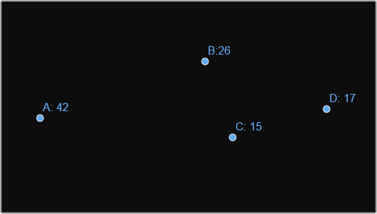

## Szavazások szabályai

Ha sok ember akar egy közös döntést hozni valamiről igazságos módon, akkor előbb utóbb elkerülhetetlen módon előfordul, hogy szavazni kell valamiről.

Hogy néz ki ez a szavazás? Mindenki kiválasztja a szavazási lehetőséget, amit szeretne, és az nyer, amire a legtöbben szavaznak. Mindig igazságos ez?

> ### Szavazás a nyaraláson
> A barátaimmal 12-en nyaralni voltunk a Horvátországban, és nem döntöttük el előre, hogy melyik nap mi legyen a program. A csoport többsége inkább túrázós, néhányan pedig inkább henyélni szeretnek, köztük én is. El kellett dönteni, hogy inkább túrázunk, vagy lemegyünk a tengerpartra, és pancsolunk. 
> 
> Nyilván én tudtam magamról, hogy a tengerpartra mennék, ezért privátban megkérdeztem mindenkitől, hogy mit akarna csinálni. Sajnálatos módon, 7-en túráznának, mert néhányójukat érdekel egy közeli barlang, illetve a másik irányban pedig van egy gyönyörű nemzeti park, míg a tengerpartot csak 5-en mondtuk. 
>
> Tehát, ha szavaznánk róla, hogy túra vagy tenger part, akkor a túra nyerne 7:5 arányban, és én szomorú lennék, mert mozognom kell. Hogyan tudom mégis elérni, hogy pancsolni menjünk, anélkül, hogy bárkit kizárnék, lefizetnék, vagy meggyőznék, hogy máshogy szavazzon?
>
> Válasz: Több opciót javaslok a szavazáskor
> |Előtte    |       | Utána          |       | 
> |----------|-------|----------------|-------|
> |Tengerpart| 5     |_**Tengerpart**_|_**5**_| 
> |_**Túra**_|_**7**_| Barlang        | 3     |
> |          |       | Nemzeti park   | 4     |
>
> Melyik szavazás volt igazságos? Baj volt az, hogy én ezt el tudtam érni? A második szavazásnál valószínüleg a barlangászók inkább mentek volna a nemzeti parkba, mint a tengerpartra, bár ezt csupán ennyi információból nem tudhatjuk.
>
> Bár akkoriban még nem tudtam, de egy sokat tárgyalt jelenséget használtam ki, a ***spoiler hatás***t. Ez akkor lép fel, amikor egy vesztes opció megjelenése befolyásolja, hogy ki nyer.

Sok emberben felmerült már, hogy egy szavazás eredménye nem igazságos, ezért rengeteg ötlet született már arra hogy, mitől lesz igazságos egy szavazás, illetve, hogy hogyan lehet ezt rendszer-szinten garantálni. Ezek alapján rengeteg különböző javaslat született, új szavazási rendszerekre, amik megpróbálják az előzők hibáit kiküszöbölni.

### Mitől lesz más két szavazási rendszer?

- Ki szavazhat
- Mik az opciók
- Titkos-e a szavazás
- **Milyen formájú egy szavazat**
  - 1 ember = 1 szavazat
  - Mindegyik szavazat ugyanannyit ér (?)
  - Hány opcióra lehet szavazni
- Hogyan számolják
- **Ki nyer**
  - Legyen győztes, a mi esetünkben pontosan 1 db
  - Kezelni a döntetlent

 ## Többségi szavazás: ("A" nyer)

 A legáltalánosabb szavazási forma, ezt láthattuk a nyaralós történetben. Nézzük meg egy másik példán keresztül, hogy milyen "igazságtalanság" fordulhat elő, hátha ott jobban látszik.

 > ### Hol legyen a buli
 > A 100 fős évfolyamon bulit szerveznek. A meghívottak négy város között oszlanak el:
 > 
 > | Település      | Létszám |
 > |----------------|---------|
 > | **A**prajafalva| 42 fő   |
 > | **B**élapátfalva| 26 fő  |
 > | **C**édruslak  | 15 fő   |
 > | **D**élvárad   | 17 fő   |
 >
 > Ezek a települések az alábbi módon helyezkednek el:
 >
 > 
 >
 > Nyilvánvalóan mindenki minél kevesebbet akar utazni, ezért ha szavazásra kerül a sor akkor a saját városát válsztja majd. Ezért az egyszerű többségi szavazás alapján **A**prajafalva nyer 42 szavazattal. Igazságos-e ez? 
 >
 > Hasonló dolog történt a nyaraláson is, ugyanis a döntő többség hamarabb választana bármilyen más opciót, mint ami nyert. **B**, **C** és **D** összesen 58 lakosának **A** a lehető legrosszabb lehetőség.

### Kritériumok

 Ezek alapján a nyaraláson az első szavazás igazságosabb volt, mint a második, hiszen ott a döntő többség nyert, és ez egy fontos tulajdonság. A pontosság igénye nélkül *Igazságossági Kritérium*-nak fogom hívni azokat a mondatokat/állításokat/feltételeket, amik úgy hangzanak, mint amiknek igaznak kéne lenniük egy rendszerre, ha az igazságos. Ezek néha ellent mondanak egymásnak, tehát lehetetlen olyan rendszert találni ami mindennek megfelel, éppen ezért érdemes meghatározni, hogy az adott esetben melyik megsértése nagyobb baj. Ezekből pedig ez az egyik:

>**Többségi Kritérium**:
>
>Ha egy opcióra döntő többség szavaz, akkor annak az opciónak kell nyernie

## Egyenkénti kieséses / Preferenciás szavazás ("D" nyer)

Mindkét példában az okozza az "igazságtalanságot", hogy azok az opciók, amiket a legtöbben szeretnének aránylag népszerűtlenek, és egymás ellen versengenek. Ha ezeket az opciókat körönként kiejtenénk, talán igazságosabb eredményt kapnánk.

Ebben a rendszerben a szavazók egy egy opciót tartalmazó szavazat helyett preferencia sorrendet állítanak fel aszerint, hogy melyik lehetőség tetszik nekik a legjobban, második legjobban, stb...

A buli szervezős példában igen könnyű felállítani ezt a sorrendet távolság alapján. Ez valahogy így nézne ki településenként:

||Aprajafalva|Bélapátfalva|Cédruslak|Délvárad|
|:-|:-:|:-:|:-:|:-:|
|1.|A|B|C|D|
|2.|B|C|D|C|
|3.|C|D|B|B|
|4.|D|A|A|A|

N opció mellett n-1 körben, mindig kiejtjük azt az opciót, amire a legkevesebben szavaztak első helyen, és a következő körben ezeknek a szavazóknak a következő preferenciáját vesszük figyelembe.

Ez többek között azért is hasznos mert így nem kell 3 különböző szavazást meghiredetni, hanem egyben le lehet zavarni az egészet.

|Első forduló||Második forduló||Harmadik forduló||
|-|-|-|-|-|-|
|Aprajafalva|42|Aprajafalva|42|~~Aprajafalva~~|42|
|Bélapátfalva|26|~~Bélapátfalva~~|26|-|-|
|~~Cédruslak~~|15|-|-|-|-|
|Délvárad|17|Délvárad|32|Délvárad|58|

Ezúttal **D** nyer. Igazságos ez? A harmadik helyről indult, ráadásul a döntő többség a legalsó két helyre sorolta.

## Két fordulós ("B" nyer)

Erősen befolyásolja az eredményt, hogy a népszerűtlen opciók között hogyan zajlik a szavazatok átadása, és ez fenyegeti a népszerűbb opciókat. Mi lenne, ha n-1 forduló helyett csak kettőt tartanánk és a második körben már csak a legnépszerűbb kettő maradna?

>Ez azt jelenti, hogy annyit javult a rendszer, hogy még az én machinálásom ellenére is a túrázás nyer:
>
>|Első forduló     |       |Második forduló   |       | 
>|:----------------|:-----:|------------------|-------|
>|Tengerpart       |5      |Tengerpart        |5      | 
>|~~---Barlang---~~|3      |                  |       |
>|Nemzeti park     |4      |_**Nemzeti park**_|_**7**_|

A négy opciós buli szervezésnél, pedig az alábbi módon alakulnak a dolgok:

|Első forduló||Második forduló||
|-|-|-|-|
|Aprajafalva|42|~~Aprajafalva~~|42|
|Bélapátfalva|26|Bélapátfalva|58|
|~~Cédruslak~~|15|-|-|
|~~Délvárad~~|17|-|-|

Ezuttal **B**élapátfalva nyer annak ellenére, hogy mindenki pontosan ugyanúgy, *őszintén* szavazott, csak a rendszert változtattuk meg! Az eredmény is igazságosnak tűnik, mi lehet a probléma?

### Taktikus szavazás két fordulóban ("C" nyer)

Mi történik, akkor, ha az emberek nem őszintén szavaznak? Játsszuk le újra az előző szavazást, azzal a változtatással, hogy **D**élvárad lakóinak támad egy ötlete: Bár nyerni nem tudnak, el tudják érni, hogy mégközelebb kerüljön hozzájuk a buli, mint amúgy.

Ha **D** az első körben **C**-re szavaz saját maga helyett, akkor **B** nem jut tovább, és a második körben kiejti még **A**-t is.

|Első forduló||Második forduló||
|-|-|-|-|
|Aprajafalva|42|~~Aprajafalva~~|42|
|~~Bélapátfalva~~|26|-|-|
|~~Cédruslak~~|0|-|-| 
|Délvárad|32|Délvárad|58|

Igazságos ez az eredmény? **C** a legkevesebb résztvevővel rendelkező település és mégis győzött! 

### Kritérium

Sajnos a taktikus szavazás nehezen elkerülhető a való világban, mert azok a rendszerek amik kizárják, azoknak sok más problémája van, de ettől függetlenül egy létező jelenség és érdemes fejben tartani. Ettől függetlenül jogosan mondhatjuk, hogy egy igazságos szavazási rendszerben nincs helye taktikus szavazásnak.

> **Őszinteségi Kritérium**
>
> Egy szavazónak nem szabad, hogy előnye származzon abból, hogy nem az őszinte preferenciája szerint rangsorolja az opciókat

### A valódi probléma a Preferenciás szavazásnál

Tegyük fel, hogy buliba fagyizást is akarunk szervezni, és olyan nagyszerű ajánlatot kaptunk, hogy ha 100 adagot rendelünk ugyanabból az ízből, akkor nagykereskedelmi áron feleannyiba kerül majd, és csak így van rá elég pénz a büdzsében. Meg kell hát szavazni, hogy a három nagy mennyiségű ízből (**A**lma, **B**anán és **C**soki) melyik legyen.

Preferenciás szavazást tartunk a 100 résztvevő között, és az alábbi összesítést kapjuk:

|39|35|26|
|-|-|-|
|A|B|C|
|B|C|A|
|C|A|B|

A preferenciák alapján a fordulók az alábbi módon zajlanak le:

|Első forduló||Második forduló||
|-|-|-|-|
|**A**lmás|39|**A**lmás|65|
|**B**anános|35|~~**B**anános~~|35|
|~~**C**sokis~~|26|

A győztes egyértelműen az **A**lmás, azonban még az eredmény kihirdetése előtt 10 **B**anán-kedvelő megkereste a szavazás kiértékelésével felelős szervezőket, azzal hogy rájöttek, hogy jobban szeretik az **A**lmás fagyit mint a többit, ezért szeretnék megváltoztatni a szavazatukat. Tehát az új preferenciás táblázat így nézne ki:

|49|25|26|
|-|-|-|
|A|B|C
|B|C|A
|C|A|B

Ahelyett hogy figyelmen kívül hagytuk volna a kérést(vagy megmondtuk volna nekik, hogy feleslegesen teszik, hiszen amúgy is az **A**lmás nyert) újra kiértékeltük a szavazatokat. 

|Első forduló||Második forduló||
|-|-|-|-|
|**A**lmás|49|~~**A**lmás~~|49|
|~~**B**anános~~|25||
|**C**sokis|26|**C**sokis|51|

10-en az utolsó helyről az első helyre írták át az **A**lmást és emiatt vesztett az **A**lmás?! Mi van??

### Kritérium

A leendő első helyezett magasabbra értékelése miatti alsóbb preferencia-változás azt eredményezte, hogy a kieső népszerűtlen opció szavazatai egy másik népszerűtlenhez kerültek a leendő első helyezett helyett. Ennek egy igazságos rendszerben nem kéne tudnia megtörténnie, és erre vonatkozik is egy kritérium.

> **Monotonitási Kritérium**
>
> Ne lehessen letaszítani a győztes opciót azzal, hogy magasabbra értékeli néhány szavazat (és ne lehessen egy vesztes opciót megválasztatni azzal, hogy néhány szavazat alacsonyabbra értékeli)

## Borda pontozási rendszer ("B" nyer)

A Borda pontozási rendszer nagyon hasonlít a preferenciás szavazáshoz, azonban azért, hogy *monoton* maradjon, pontozást használ sorrend helyett.

A szavazó preferencia sorrendje szerint kapnak pontokat az opciók, és a legtöbb ponttal rendelkező opció nyer. 

||Aprajafalva|Bélapátfalva|Cédruslak|Délvárad|
|:-|:-:|:-:|:-:|:-:|
|3|A|B|C|D|
|2|B|C|D|C|
|1|C|D|B|B|
|0|D|A|A|A|

Ez alapján összesítve a települések végső pontszámai a következőek:

| Település      |Pontszám |
|----------------|---------|
| **A**prajafalva| 126   |
| **B**élapátfalva| 194  |
| **C**édruslak  | 173   |
| **D**élvárad   | 131   |

Ezek alapján **B**élapát falva nyer. Mi a baj vele? Nagyon könnyen befolyásolható a spoiler hatással és taktikus szavazással. Ezek hiányában viszont rendkívűl magasan végez olyan teszteken, amik szavazási rendszereket mérnek elégedettség alapján.A másik problémájához viszont meg kell néznünk még egy rendszert.

## Condorcet módszer ("C" nyer)

Condorcet Borda riválisa volt, és erősen ellenezte a módszerét a korábban említett problémák miatt. (Mindketten franciák és a franci a forradalom idején egy igazságos módszer megtalálása nagyon fontos volt)

Az ő módszerét alkalmazva minden egyes opciót összehasonlítunk minden másikkal, és az összes szavazó eldönti mindig, hogy az adott párosból melyiket preferálja. Ezzel megnehezíti egy picit a taktikus szavazást.

Ez a buli szervezésnél az alábbi módon néz ki:

|A|[B]||A|[C]||A|[D]|
|-|-|-|-|-|-|-|-|
|42|58||42|58||42|58|

|[B]|C||[B]|D||[C]|D|
|-|-|-|-|-|-|-|-|
|68|32||68|32||83|17|

Ez alapján, a Borda-módszerhez hasonlóan, **B**élapátfalva nyer, és szoros másodikként jön  **C**édruslak. Ezek tényleg a térkép relatív közepén helyezkednek el, és **B**élapátfalván több résztvevő lakik. 

### Kritérium
Bevezet ez a rendszer egy további nagyon fontos kritériumot is, aminek a Borda-módszer nem felel meg. Ez egy szükséges feltétele a Többségi Kritériumnak is, aminek emiatt szintén nem felel meg Borda módszere.

> **Condorcet Kritérium**
>
> Ha egy opció minden mással összehasonlítva nyer, akkor végezetül is győznie kell.

Oké. Ezzel mi a baj akkor? Az egyik a Condorcet paradox, ahol a szavazók kő-papír-olló ciklusban preferálják az opciókat. Ebben a felállásban nem választ győztest. Vannak variációi, amik igen, de ezek sok más rendszerrel egyetemben megsértik a következő, sokat vitatott kritériumot.

### Probléma a Condorcet módszerrel

 A buli 20 fős szervezői bizottsága még mindig megpróbálja eldönteni a fagyi kérdést,azonban ezúttal nem kéri ki a többiek véleményt, hanem csak a szűk csoporton belül szavaz. Ez nyilván bunkóság, de matematikailag csak az a fontos, hogy most egy másik szavazásról beszélünk.

 A korábbiakból tanulva most nem preferenciás szavazást használnak, hanem a Condorcet módszernek adnak egy esélyt.

 Páran azt hallották, hogy van egy negyedik íz is, a **D**iós. A preferenciák az alábbi módon láthatóak:

 |5|5|26|
 |-|-|-|
 |D|A|B|
 |A|C|D|
 |C|B|A|
 |B|D|C|

 Ez alapján a Condorcet összehasonlítások így néznek ki:
 
|A|B||[A]|C||A|[D]|
|-|-|-|-|-|-|-|-|
|10|10||14|6||5|15|

|B|[C]||[B]|D||[C]|D|
|-|-|-|-|-|-|-|-|
|4|16||15|5||11|9|

A **C**sokis fagyit választotta meg a bizottság. Pár perccel később azonban kiderül, hogy a **D**iós fagyi mégsem elérhető nagykereskedelmi áron, és a korábbi tapasztalatból ezúttal nem tanulva újra kiszámolják a győztest az új felállásban, ahelyett, hogy elfogadnák a döntést.

|A|B||[A]|C||B|[C]|
|-|-|-|-|-|-|-|-|
|10|10||14|6||4|16|

Ez alapján viszont az **A**lmás fagyi győz, pedig csak kiszedtünk egy vesztes opciót a versenyből. Ez ismerősen hangozhat, hiszen ez a spoiler hatás.

### Kritérium

A spoiler hatás egész végig egy meg-nem nevezett kritérium volt, aminek a Condorcet módszer nem felel meg.

> **Függetlenségi Kritérium**
>
> Egy új, nem-győztes opció bevezetése nem szabad, hogy befolyásolja a korábbi opciók egymáshoz képesti sorrendjét.

Sidney Morgenbesser az alábbi történettel szemlélteti a jelenséget:

Morgenbesser desszertet rendel, és a pincérnő közli vele, hogy választhat áfonyás vagy almás pite között. Ő az almásat választja. Nem sokkal később a pincérnő visszatér, és tudatja, hogy a meggyes pite is egy lehetőség. Erre Morgenbesser így felel: „Akkor ebben az esetben áfonyásat kérek.”

## Arrow Lehetetlenségi tétele

A Függetlenségi Kritérium sok kritikát kap miszerint a betartása irreális vagy elvárhatatlan, ugyanis csak két rendszer tud feltétel nélkül teljesíteni, illetve még kettő kötött feltételek mellett. Kenneth Arrow 1950-ben bebizonyította, hogy lehetetlen olyan választási rendszert alkotni, ami legalább három opció mellett ami a függetlenségi kritérium mellett betart 4 alapvető szabályt:
- Nincs diktátor, akinek a szava dönt
- Minden szavazat figyelembevételével egyértelmű győztest tud választani
- minden szavazó preferenciája tranzitív (A > B & B > C => A > C)
- Ha minden szavazó szerint jobb az egyik opció, mint a másik, akkor a végeredményben is előbb kell szerepelnie

Nézzük meg, hogy mik azok, amik viszont nem sértik a függetlenségi kritériumot.

## Beleegyezéses szavazás

https://en.wikipedia.org/wiki/Approval_voting

## Random diktátor

https://en.wikipedia.org/wiki/Random_ballot

## Taktikus szavazás pt. 2

https://en.wikipedia.org/wiki/Strategic_voting
